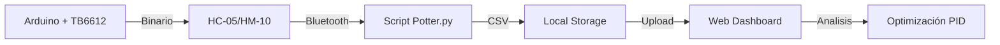

# Arquitectura de Soccer Jr.

Este documento detalla la estructura lógica y técnica de la plataforma Soccer Jr. Academy.

## 1. Sistema de Contenidos (Content Layer)

Utilizamos **Astro Content Collections** para gestionar las lecciones. Esto garantiza:
- **Tipado Fuerte**: Definido en `src/content/config.ts`.
- **Modularidad**: Las lecciones se organizan en carpetas numeradas para mantener el orden en el sidebar.
- **Interactividad**: El uso de MDX permite inyectar componentes Astro (como `<MaterialLink />`) directamente en el markdown educativo.

## 2. Herramientas de Ingeniería (Islands)

El **Simulador** y el **Dashboard** operan como "Islas de Interactividad" utilizando React. 
- **Simulador**: Utiliza lógica de física simplificada para emular un móvil sobre una línea negra.
- **Dashboard**: Utiliza `papaparse` para el procesamiento cliente-side de archivos CSV sin necesidad de un backend.
- **Visualización**: Se utiliza `Chart.js` con plugins de zoom para permitir el análisis detallado de carreras que duran varios segundos.

## 3. Flujo de Datos de Telemetría

1.  **Captura**: El Firmware envía paquetes binarios compactos para minimizar latencia.
2.  **Procesamiento**: El script de Python (`Potter.py`) desempaqueta los datos y los guarda en archivos estandarizados.
3.  **Análisis**: El usuario carga el CSV en el Dashboard para identificar fallas en el control.

## 4. Diseño y Estética

La interfaz sigue los principios de **"Dark Engineering"**:
- **Paleta**: Fondos `#0a0a0a` con acentos en `brand-orange` (Control) y `brand-blue` (Telemetría).
- **Tipografía**: Inter (Sans-serif) para legibilidad técnica.
- **Componentes**: Bordes redondeados (`3xl`), bordes sutiles y gradientes radiales para un look premium.

## 5. Mantenimiento del Sílabo

Para agregar una nueva lección:
1.  Crear el archivo `.mdx` en la carpeta correspondiente en `src/content/lessons/`.
2.  Asegurar que el frontmatter incluya `title`, `order` (para el sidebar) y `description`.
3.  El sistema de navegación actualizará automáticamente el sidebar y los botones de "Anterior/Siguiente".
